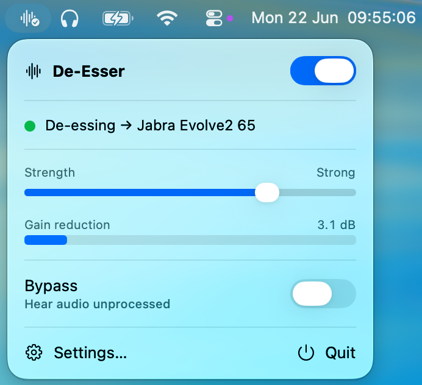

# macOS System De-Esser

<p align="left">
  
</p>

**macOS System De-Esser** is a local, on-device menu-bar utility that reduces harsh sibilance (the
painful "S" / "SH" sounds) in **all of your Mac's audio** in real time — without
ever touching your microphone. Toggle it on when what you're listening to is
harsh, and off when it isn't.

It uses public **Core Audio process-tap** APIs on macOS Tahoe (26). There is **no
audio driver, no system/kernel extension, and no virtual device**. Audio is never
recorded, saved, or sent anywhere.

---

## How it works

```
All system audio (every process except this app)
      │  Core Audio global tap (stereoGlobalTapButExcludeProcesses:, mutedWhenTapped)
      ▼
Private aggregate-device input
      │  real-time AudioDeviceIOProc
      ▼
De-esser — a faithful port of the Calf "Deesser" (the de-esser EasyEffects uses)
      ▼
The current default output device
```

The tap captures every process **except De-Esser itself** (excluded by PID so the
processed audio it replays is not re-captured). The original audio is muted **only
while the tap is being read**, so if anything goes wrong the normal, unprocessed
audio resumes automatically (fail-open).

**Known limitation:** the tap is global and unscoped, so all audio is routed to
the single default output device. If you split audio across two output devices at
once, both are funneled to the default while De-Esser is enabled.

---

## Install

**Download the latest `DeEsser.dmg` from the [Releases](../../releases) page**, open
it, and drag **DeEsser.app** to your **Applications** folder. Then launch it — look
for the waveform icon in the menu bar (it has no Dock icon).

### First launch — Gatekeeper

The app is **ad-hoc signed and not notarized** (it's free and open-source, with no
paid Apple Developer ID). So the first time you open it, macOS will warn that it
"cannot verify the developer." To open it anyway:

1. Try to open **DeEsser.app** once (the warning appears — that's expected).
2. Go to **System Settings ▸ Privacy & Security**, scroll to the Security section,
   and click **Open Anyway** next to the DeEsser message.
3. Confirm. macOS remembers the choice; you won't be asked again for this version.

> Prefer not to trust a downloaded binary? [Build from source](#build) instead —
> a locally built app isn't quarantined and opens without this step.

### Updating

Because the app is ad-hoc signed, each released version has a different signature,
so **after installing a new version macOS may ask you to re-grant system-audio
recording permission** (System Settings ▸ Privacy & Security ▸ System Audio
Recording). This is expected and only takes a click. (A paid Developer ID would
keep the grant across updates; this project doesn't use one.)

---

## Requirements

To **run**: macOS Tahoe **26.0+**, on Apple Silicon or Intel.

To **build from source** you additionally need:

- Xcode **26.x** (macOS 26 SDK)
- [XcodeGen](https://github.com/yonaskolb/XcodeGen) (`brew install xcodegen`) —
  only if you change `project.yml`

---

## Build

The Xcode project is generated from `project.yml` with
[XcodeGen](https://github.com/yonaskolb/XcodeGen) (a build-time tool only — not a
runtime dependency). A generated `DeEsser.xcodeproj` is included, so you can build
directly.

```bash
# (Only if you changed project.yml)
xcodegen generate

# Build (Debug)
xcodebuild \
  -project DeEsser.xcodeproj \
  -scheme DeEsser \
  -configuration Debug \
  -destination 'platform=macOS' \
  build

# Run unit tests (DSP + orchestration)
xcodebuild \
  -project DeEsser.xcodeproj \
  -scheme DeEsser \
  -destination 'platform=macOS' \
  test

# Static analysis (Release)
xcodebuild \
  -project DeEsser.xcodeproj \
  -scheme DeEsser \
  -configuration Release \
  -destination 'platform=macOS' \
  analyze
```

To run the app, open the project in Xcode and ⌘R, or launch the built
`DeEsser.app` from `~/Library/Developer/Xcode/DerivedData/.../Build/Products/`.
Because it is a menu-bar accessory (`LSUIElement`), it has **no Dock icon** — look
for the waveform icon in the menu bar.

---

## Permissions

On the **first time you enable** processing, the app explains that macOS will ask
for **system-audio recording** permission and that audio stays on this Mac. After
you tap **Continue**, macOS shows its standard prompt.

- The app requests **only** system-audio capture (`NSAudioCaptureUsageDescription`).
  It never requests microphone access.
- If you later deny or revoke permission, normal audio keeps working; the app
  shows a recoverable error and offers an **Open Privacy & Security** button. You
  can also enable it manually under
  **System Settings ▸ Privacy & Security ▸ System Audio Recording**.

The bundle identifier is `local.DeEsser`; the granted permission is keyed to it.

---

## Operation

Click the menu-bar icon:

- **Master switch** — turns processing on/off. When off, your audio is completely
  untouched (no tap, no aggregate device). This is the control you flip when a
  particular source sounds harsh.
- **Status** — Disabled · Permission required · Starting · *De-essing → \<device\>*
  · Rebuilding · Error.
- **Strength** — the single de-essing control. It scales the Calf de-esser's
  detection threshold and ratio together (0 = gentle, 0.5 = the stock EasyEffects
  default, 1 = deliberately heavy — threshold −42 dBFS, ratio 12:1, for a very
  obvious drop in harsh sibilance). Everything else is pinned to the
  EasyEffects/Calf defaults.
- **Gain-reduction meter** — live, 0–24 dB.
- **Bypass** — keeps audio captured but crossfades the de-esser to unity, for
  click-free A/B testing. (Different from the master switch, which removes the
  tap entirely.)
- **Settings…** — startup options, launch-at-login, the strength slider, and a
  **Diagnostics** tab (chosen device, object IDs, heartbeat, meters, last Core
  Audio error, and a *Copy diagnostic report* button — **metadata only, never
  audio**).

The processed audio automatically follows the current default output device.
Output-device changes, sample-rate/AirPods-profile changes, and sleep/wake all
trigger a controlled, debounced rebuild.

---

## Privacy

- No audio is recorded, saved, transcribed, transmitted, or retained.
- No network access. No analytics. No update framework.
- Your **microphone is never captured** — only audio your apps are playing back.
- Diagnostic reports contain configuration/metadata only.

---

## License

[MIT](LICENSE) © 2026 Cristian Greco
